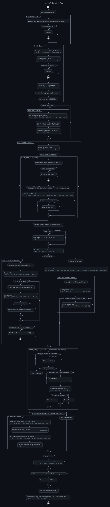

# un-🦭

`un-seal` is a confined Snap utility designed to automate the initialisation, unsealing, and authorisation of Vault applications deployed via Juju. 

## Overview

Deploying a charmed Vault with Juju requires a specific sequence of operations to bootstrap the cluster: initialising the Vault operator, securely managing the generated unseal keys and root token, unsealing individual units, and authorising the charm to interact with the Vault API.

`un-seal` streamlines this workflow into a single interactive command. It natively supports both standard Juju Machine deployments (LXD/Bare-metal) and Juju Kubernetes deployments (such as Canonical Sunbeam). It is designed for security-conscious environments, supporting split-file credential storage and GPG encryption (compatible with hardware tokens such as YubiKey) to facilitate separation of duties.

**Important Note:** This tool is currently designed for Vault clusters managed by Juju. It does not *yet* support standalone Kubernetes Vault deployments (WIP).

The tool automatically detects the state of the cluster and performs the necessary actions:

1.  Cluster Initialisation: Generates key shares and the root token, encrypts them individually to a specified directory, and unseals the cluster.
2.  Cluster Unsealing: Detects sealed units (e.g., following a restart), decrypts the necessary keys from storage, and brings the cluster online.

## Features

* Automated Leader Detection: Queries the Juju model to identify and target the application leader for initialisation.
* Dynamic Environment Detection: Automatically differentiates between Systemd-based Juju Machine charms and Pebble-based Juju Kubernetes charms (distroless containers).
* Cross-Model / Sunbeam Support: Seamlessly interact with Vault clusters deployed in different Juju models (e.g., the `openstack` model used by Canonical Sunbeam) using the `--model` flag.
* Auto-Healing: Detects machine units in failure states (e.g., `hook failed`, `service not running`), corroborates using `systemctl is-active`, and automatically triggers a service restart via `juju exec`. Intelligently bypasses this logic for Juju Kubernetes deployments to allow native K8s self-healing.
* Dependency Validation: Pre-checks the `mysql-router` subordinate status to verify database connectivity. Fails if the backend is unreachable to prevent indefinite hanging.
* Version Compatibility: Automatically analyses the charm channel to distinguish between Legacy (<=1.8) and Modern Vault. Adjusts logic dynamically.
* Multi-File Credential Storage: Stores the root token and each unseal key in separate GPG-encrypted files (e.g., `vault_token.gpg`, `vault_key1.gpg`). This architecture supports the separation of duties by allowing keys to be distributed among different operators.
* Hardware-Backed Security: Fully integrates with GPG, enabling the use of smart cards and YubiKeys for encryption and decryption operations. Uses internal loopback pinentry to request passwords directly in the terminal, eliminating the need for external GUI/TUI popups.
* Resilient Credential Loading: Implements a three-tier logic to retrieve keys:
    1.  Auto-Load: Scans the credentials directory for encrypted files.
    2.  File Prompt: Prompts for specific file paths if automatic detection is incomplete.
    3.  Manual Entry: Accepts raw input for keys and tokens as a final fallback mechanism.
* Smart Threshold Detection: Queries the Vault status to determine the exact number of unseal keys required before prompting the user.
* Charm Authorisation: Automates the Juju secret lifecycle (`add-secret` -> `grant-secret` -> `authorize-charm`) to provision the charm with the root token securely.
* Secure Cleanup: Utilises `shred` to overwrite and remove sensitive temporary files (such as the CA certificate) immediately after use.

## Dependencies

### Host Requirements
This snap uses Juju to interact with the vault charm, make sure it is installed:

* `juju` Required to interface with your controller/model.
    ```bash
    sudo snap install juju
    ```

### Bundled Dependencies

The snap comes pre-packaged with the following binaries; no manual installation is required:
* `vault` (CLI client)
* `jq` (JSON processor)
* `gpg` (GnuPG)

## Installation

### Snap Store
Install the snap:

```bash
sudo snap install un-seal
```

This snap is built with `strict` confinement; you must manually enable the following interfaces to interact with your system's tools. Ensure these are connected:

```bash
sudo snap connect un-seal:dot-local-share-juju   # R/W Access to Juju's .local/share/juju
sudo snap connect un-seal:gpg-keys               # Access to GPG's keys
sudo snap connect un-seal:pcscd                  # Access to PCSCD smart card daemon [optional]
```

### From Precompiled .snap:
Download the latest compiled .snap from [releases](https://github.com/Ankow99/un-seal/releases).
```bash
sudo snap install ./un-seal_6.0.0_amd64.snap --dangerous

sudo snap connect un-seal:juju-bin juju:juju-bin
sudo snap connect un-seal:dot-local-share-juju
sudo snap connect un-seal:gpg-keys
sudo snap connect un-seal:pcscd #[optional]
```

### Build from Source
To build and install locally:

1.  Clone the repository:
    ```bash
    git clone [https://github.com/Ankow99/un-seal.git](https://github.com/Ankow99/un-seal.git)
    cd un-seal
    ```
2.  Make sure the `un-seal` binary is set as executable
    ```bash
    chmod +x un-seal
    ```
3.  Pack the snap:
    ```bash
    snapcraft pack
    ```
4.  Install the generated snap:
    ```bash
    sudo snap install ./un-seal_6.0.0_amd64.snap --dangerous
    ```
5.  Connect the interfaces:
    ```bash
    sudo snap connect un-seal:juju-bin juju:juju-bin
    sudo snap connect un-seal:dot-local-share-juju
    sudo snap connect un-seal:gpg-keys
    sudo snap connect un-seal:pcscd #[optional]
    ```
### Use as a script
Alternatively, you can also use the main binary as an executable script:

1.  Clone the repository:
    ```bash
    git clone [https://github.com/Ankow99/un-seal.git](https://github.com/Ankow99/un-seal.git)
    cd un-seal
    ```
2.  Make sure the `un-seal` binary is set as executable
    ```bash
    chmod +x un-seal
    ```
3.  Install the dependencies:
    ```bash
    sudo apt install jq gpg
    sudo snap install juju vault
    ```
4.  Run the binary:
    ```bash
    ./un-seal [options]
    ```

## Usage

Execute the command from a terminal. The tool will attempt to discover a `vault` application in the currently active Juju model.

```bash
un-seal [options]
```

### Options

| Flag | Long Flag | Description | Default |
| :--- | :--- | :--- | :--- |
| `-n` | `--charm-name` | The name of the Juju Vault application. | `vault` |
| `-m` | `--model` | The specific Juju model to target (e.g., `openstack`). | *(current active model)* |
| `-s` | `--key-shares` | Number of key shares to generate (Init only). | `3` |
| `-t` | `--key-threshold` | Number of keys required to unseal (Init only). | `2` |
| `-T` | `--timeout` | Minutes to wait for units to initialize. | `10` |
| `-d` | `--creds-dir` | Directory to save/load GPG-encrypted files. | `$HOME/<model-name>_creds/` |
| `-g` | `--gpg-id` | GPG Key ID/Email for encryption (Init only). | *(Prompts if empty during init)* |
| `-a` | `--skip-auth` | Force skip the charm authorisation steps (5-8). | `false` |
| `-S` | `--seal` | (Easter Egg) Invoke a cute Seal after success. | `false` |
| `-h` | `--help` | Show help message. | |

## Examples

Initialize and unseal a Canonical Sunbeam Vault deployment invoking the seal:

```bash
un-seal --model openstack -S
```

Initialise a Machine-deployed application named `vault-ha` with 5 key shares and a threshold of 3, encrypting credentials for a specific GPG recipient:

```bash
un-seal --charm-name vault-ha -s 5 -t 3 --gpg-id "admin@example.com"
```

Unseal a cluster using keys stored on external media: *(requires additional `removable-media` interface connection if using as a snap)*

```bash
un-seal --creds-dir /media/secure-usb/vault_keys/
```

## Technical Workflow

1.  Environment Validation: Checks for the presence of required dependencies (`juju`, `gpg`, `vault`) and confirms the target application exists in the target Juju model.
2.  GPG Environment Setup: Detects if running inside a Snap, configures `gpg-agent` for loopback mode, and syncs public/private keys (stubs) from the host.
3.  Leader & Version Analysis: Identifies the Juju leader unit and inspects the `charm-channel` to distinguish between Legacy (≤1.8) and Modern (>1.8) architectures.
4.  Health Check & Auto-Healing:
    * Dependency Check: Verifies the `mysql-router` subordinate status; aborts immediately if the database connection is blocked to prevent indefinite hanging.
    * Recovery (Juju Machine Only): Detects machine units in failure states (`hook failed`, `service not running`) and corroborates using `systemctl is-active`. If the database is healthy, it executes a remote `systemctl restart vault` via Juju. If a Juju Kubernetes/Pebble environment is detected, it bypasses this step to allow native K8s self-healing.
5.  CA Retrieval (Modern Only): Retrieves the `self-signed-vault-ca-certificate` secret from Juju to establish a secure TLS connection with the Vault units.
6.  Protocol Selection: Dynamically sets the Vault address protocol to `http` for Legacy units or `https` for Modern units.
7.  State Management:
    * Initialisation: Executes `operator init`. The output is parsed, and the root token and unseal keys are encrypted into individual files within the specified credentials directory.
    * Unsealing: Queries the seal status. If sealed, the tool attempts to decrypt sufficient keys from the directory. If keys are missing, it requests file paths or raw input.
8.  Unseal Operations: Bypasses Juju Kubernetes network isolation dynamically. For Juju K8s deployments, it uses `juju exec` and `pebble exec` to securely tunnel commands directly into the distroless Charmed Vault container socket. For Machine deployments, it runs the native Vault CLI utilizing the exported CA certificate. Unseals the **Leader** unit first to ensure cluster consensus, then iterates through all follower units.
9.  Charm Authorisation: Passes the Root Token to the Juju charm via a short-lived Juju secret, executing the `authorize-charm` action to complete the charm configuration.
10. Post-Unseal Configuration (Legacy Only): If a Legacy version is detected, executes the `generate-root-ca` action on the leader immediately after authorisation.
11. Cleanup: Securely shreds temporary files created during execution. The encrypted credential files are preserved for backup purposes.

## UML of Execution Flow



## License

This project is licensed under the GPL-3.0-only license. See the `LICENSE` file for details.
